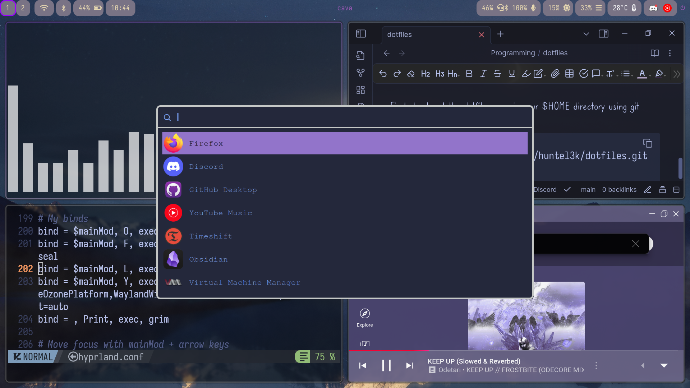
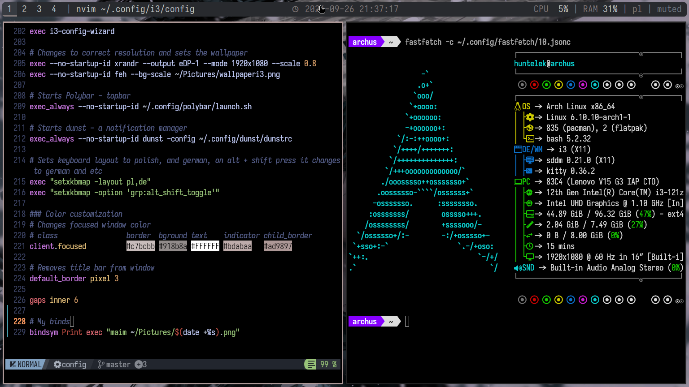

This repository contains my dotfiles for [Hyprland](https://hyprland.org) and [i3](https://i3wm.org).

# Hyprland
 
# i3wm



## Requirements

Ensure you have following installed on the system:

### Git 

```
pacman -S git
```

### Stow

```
pacman -S stow
```

## Installation

First check out the dotfiles repo in your $HOME directory using git

```
$ git clone git@github.com/huntel3k/dotfiles.git
$ cd dotfiles
```

then use GNU stow to create symlinks

```
$ stow .
```

> [!WARNING]\
> W.I.P

